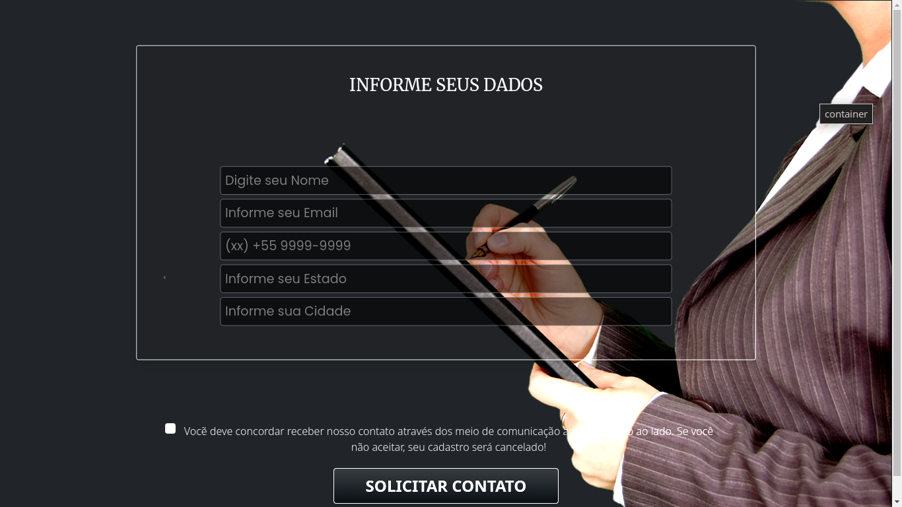

# FORM 6

### Tecnologia de Desenvolvimento
- Boostrap
- css
- Editor Gráfico (Pinegrow)
- Responsividade para dispositivos móveis.

*Imagem de fundo não se adapta adequadamente para dispositivos móveis. Em outra versão farei a adaptação da imagem.* Também é preciso validar os campos para Telefone/Celular para autopreenchimento quando o usuário inserir as informações. 

**Dados Solicitados** 
- Nome Completo
- Email para Contato
- Telefone/Celular
- Estado/Cidade
- Checkout
- Botão Solicitar Contato

Também é possível acrescentar mais informações no formulário em HTML. Basta abrir o index.html no seu editor de texto ou IDE preferida **copiar** e **colar** as tags &lt;input&gt; e inseri-las na posição que deseja. 

Para alterar a imagem de fundo, acesso o arquivo **css/** e edite a classe **.bimg**.
> background-image: url(Inserir aqui sua imagem);

Ao modificar a imagem, tente inserir imagens que estão hospedadas em servidores como **HTTP** e **HTTPS** ao invés de colocar um caminho relativo ou absoluto ao seu projeto raiz como **../assets/img/img.png**.

